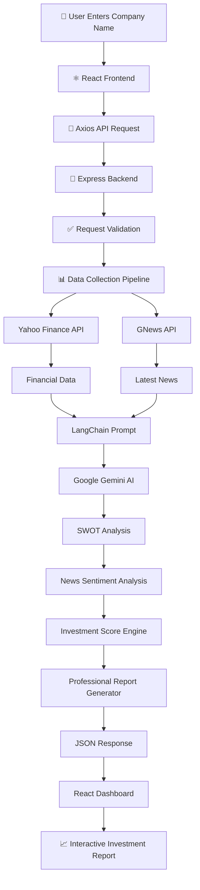
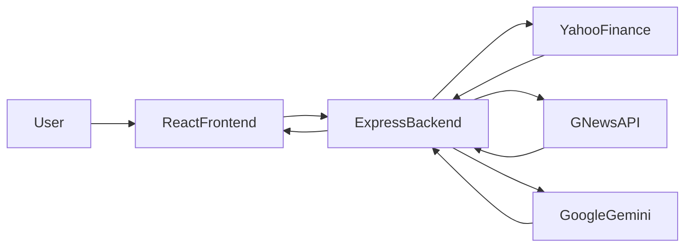

<<<<<<< HEAD
# 📈 InvestIQAgent - Autonomous AI Investment Researcher


**InvestIQ Agent** is a full-stack AI-powered market intelligence application. It autonomously aggregates real-time company financials, evaluates recent news sentiment, and utilizes Google's Gemini AI (via LangChain) to conduct institutional-grade SWOT analyses on any publicly traded stock.

---


## ✨ Features
=======
# 📈 InvestIQAgent – Autonomous AI Investment Researcher

<p align="center">
  <b>AI-Powered Investment Research Platform</b><br>
  Analyze any publicly traded company using Artificial Intelligence, Real-Time Financial Data, News Sentiment Analysis, and Google Gemini.
</p>

---

# 🚀 Overview
>>>>>>> fa966c9 (ReadMe)

InvestIQ Agent is a full-stack AI-powered market intelligence platform that autonomously analyzes publicly traded companies by collecting live financial data, evaluating recent news sentiment, and generating institutional-grade SWOT analyses using Google's Gemini AI through LangChain.

The platform combines financial intelligence with generative AI to produce a professional investment research report, helping users make data-driven investment decisions.

---

<<<<<<< HEAD

## 🛠️ Tech Stack
=======
# ✨ Features
>>>>>>> fa966c9 (ReadMe)

✅ AI-Powered SWOT Analysis

- Generates detailed Strengths
- Identifies Weaknesses
- Predicts Opportunities
- Detects Risks & Threats

✅ Real-Time Financial Analysis

- Current Stock Price
- Market Capitalization
- Exchange
- Currency
- 52 Week High
- 52 Week Low

✅ Latest Company News

- Fetches latest news using GNews API
- Displays top company headlines
- Provides news summaries

✅ AI News Sentiment Analysis

- Bullish
- Bearish
- Neutral

✅ Investment Recommendation

- Custom Investment Score (0-100)
- INVEST
- HOLD
- PASS

✅ Professional Dashboard

- Modern Responsive UI
- Glassmorphism Design
- Dark Theme
- Mobile Friendly

---

# ⚙️ Complete Project Workflow



---

# 🏗 System Architecture



---

# ⚙ Backend Processing Pipeline

```mermaid
graph TD

Request

-->

Research Controller

-->

Request Validator

-->

Research Service

-->

Investment Agent

-->

Data Collector

-->

Financial Service

-->

News Service

-->

News Sentiment Analyzer

-->

AI Analyzer

-->

Investment Score Engine

-->

Report Generator

-->

API Response
```

---

# 🛠 Technology Stack

## Frontend

- React.js
- Vite
- Axios
- Vanilla CSS
- Responsive Design

## Backend

- Node.js
- Express.js
- REST APIs
- Middleware

## Artificial Intelligence

- Google Gemini 2.5 Flash
- LangChain
- Prompt Engineering

## External APIs

- Yahoo Finance API
- GNews API

## Documentation

- Swagger UI

## Validation

- Joi Validator

## Logging

- Morgan

## Deployment

- Vercel (Frontend)
- Render (Backend)

---

# 📂 Project Structure

```
ResearchAI-Agent
│
├── Backend
│   ├── agents
│   ├── cache
│   ├── config
│   ├── controllers
│   ├── docs
│   ├── middleware
│   ├── pipeline
│   ├── routes
│   ├── services
│   ├── utils
│   ├── validators
│   ├── server.js
│   └── package.json
│
├── Frontend
│   ├── public
│   ├── src
│   │   ├── components
│   │   ├── pages
│   │   ├── services
│   │   ├── assets
│   │   ├── hooks
│   │   └── App.jsx
│   │
│   ├── package.json
│   └── vite.config.js
│
├── README.md
└── LICENSE
```

---

# 🔄 AI Processing Flow

```
Company Name
        │
        ▼
Financial Data Collection
        │
        ▼
Latest News Collection
        │
        ▼
News Sentiment Analysis
        │
        ▼
Prompt Engineering
        │
        ▼
Google Gemini AI
        │
        ▼
SWOT Analysis
        │
        ▼
Investment Score Calculation
        │
        ▼
Professional Investment Report
        │
        ▼
Interactive Dashboard
```

---

# 📡 API Endpoints

| Method | Endpoint | Description |
|---------|----------|-------------|
| GET | /api/v1/health | Server Health Check |
| POST | /api/v1/research | Generate Investment Report |
| GET | /api-docs | Swagger Documentation |

---

# 🚀 Local Setup

## Clone Repository

```bash
git clone https://github.com/SJRVedRupesh/ResearchAI-Agent.git
cd ResearchAI-Agent
```

---

## Backend Setup

```bash
cd backend
npm install
npm run dev
```

Create `.env`

```env
PORT=5000
GEMINI_API_KEY=YOUR_GEMINI_API_KEY
GNEWS_API_KEY=YOUR_GNEWS_API_KEY
```

---

## Frontend Setup

```bash
cd frontend
npm install
npm run dev
```

Create `.env`

<<<<<<< HEAD
## 🌍 Deployment 

### Deploying the Backend (Render)
1. Push code to GitHub.
2. Create a new **Web Service** on [Render](https://render.com).
3. Connect your GitHub repository.
4. Set the Root Directory to `backend`.
5. Build Command: `npm install`
6. Start Command: `node server.js`
7. **Crucial Step**: Add your `GEMINI_API_KEY` and `GNEWS_API_KEY` in the Environment Variables section on Render.

### Deploying the Frontend (Vercel)
1. Import GitHub repository to [Vercel](https://vercel.com).
2. Set the Framework Preset to **Vite**.
3. Set the Root Directory to `frontend`.
4. **Crucial Step**: Add an Environment Variable named `VITE_API_URL` and set it to your deployed Render backend URL (`https://your-backend.onrender.com/api/v1`).
5. Click **Deploy**.
=======
```env
VITE_API_URL=http://localhost:5000/api/v1
```
>>>>>>> fa966c9 (ReadMe)


<<<<<<< HEAD

=======
# 🌍 Deployment

## Backend (Render)

- Push code to GitHub
- Create Render Web Service
- Root Directory → backend
- Build Command → npm install
- Start Command → node server.js
- Add Environment Variables
  - GEMINI_API_KEY
  - GNEWS_API_KEY

---

## Frontend (Vercel)

- Import GitHub Repository
- Framework → Vite
- Root Directory → frontend
- Add Environment Variable

```
VITE_API_URL=https://researchai-agent.onrender.com/api/v1
```

Deploy.

---

# 💡 Key Design Decisions

- Used React for reusable component-based UI.
- Used Vite for faster development and optimized builds.
- Used Express.js to build lightweight REST APIs.
- Used LangChain to simplify prompt engineering and AI orchestration.
- Used Google Gemini for AI-generated SWOT analysis.
- Used Yahoo Finance for live financial data.
- Used GNews API for recent company news.
- Used Joi for request validation.
- Used Swagger for interactive API documentation.
- Used Render and Vercel for cloud deployment.

---

# ⚖ Trade-offs

- Used in-memory cache instead of Redis to keep the project lightweight.
- Used Gemini Flash for faster response times.
- Reports are generated dynamically instead of storing them in a database.
- Focused on modular architecture instead of adding user authentication.

---

# 📈 Future Improvements

- User Authentication
- Portfolio Management
- Watchlist Feature
- Historical Stock Charts
- PDF Report Export
- Email Notifications
- Redis Caching
- MongoDB Integration
- Docker Support
- CI/CD Pipeline
- Multi-Agent Collaboration
- Voice-Based Investment Assistant
- Real-Time Stock Alerts
- Personalized Investment Recommendations

---

# 📷 Example Companies Tested

- NVIDIA
- Tesla
- Apple
- Microsoft
- Google
- Amazon

---

# 👨‍💻 Developed By

**Rupesh Kumar**

B.Tech Computer Science Engineering (2027)

AI Engineer Aspirant

GitHub: https://github.com/SJRVedRupesh

---
>>>>>>> fa966c9 (ReadMe)
